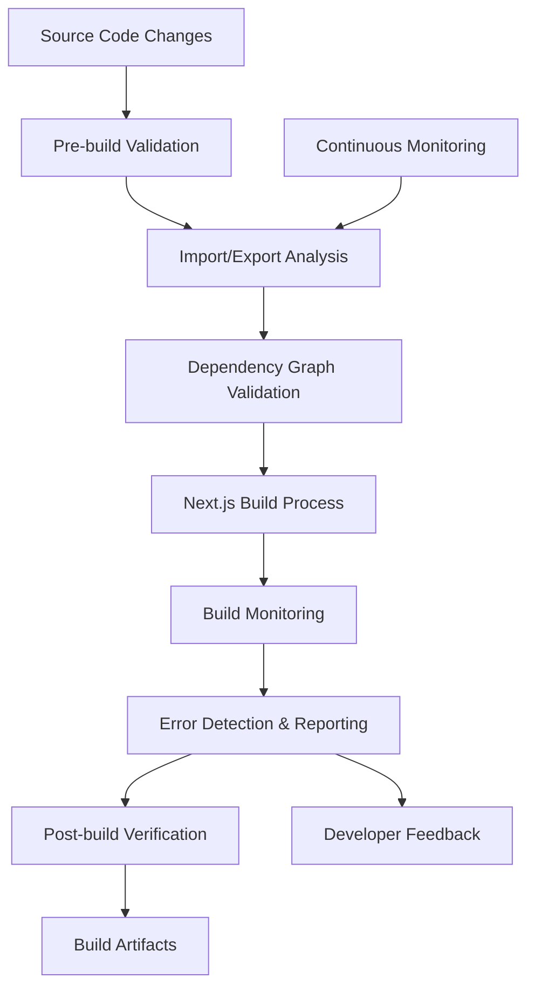

# Build Stability Design Document

## Overview

The build stability system ensures reliable compilation of the Next.js application by implementing comprehensive import/export validation, dependency management, and build process monitoring. The system addresses common build failures such as missing default exports, circular dependencies, and module resolution issues while providing clear diagnostics for rapid issue resolution.

## Architecture

The build stability system operates as a multi-layered approach:

1. **Pre-build Validation Layer**: Validates module structure before compilation
2. **Build Process Monitoring**: Tracks compilation progress and captures detailed error information
3. **Post-build Verification**: Ensures build artifacts are complete and valid
4. **Continuous Monitoring**: Ongoing validation of import/export consistency



## Components and Interfaces

### Build Validator
- **Purpose**: Validates module structure and import/export consistency
- **Interface**: `validateBuild(sourceDir: string): ValidationResult`
- **Responsibilities**:
  - Analyze TypeScript/JavaScript files for import/export patterns
  - Detect missing default exports and named exports
  - Identify circular dependencies
  - Validate module resolution paths

### Dependency Analyzer
- **Purpose**: Analyzes and validates dependency relationships
- **Interface**: `analyzeDependencies(projectRoot: string): DependencyGraph`
- **Responsibilities**:
  - Build dependency graph from import statements
  - Detect circular dependencies
  - Validate external package imports
  - Check for unused dependencies

### Build Monitor
- **Purpose**: Monitors Next.js build process and captures errors
- **Interface**: `monitorBuild(buildCommand: string): BuildResult`
- **Responsibilities**:
  - Execute build process with enhanced logging
  - Capture and parse build errors
  - Track build performance metrics
  - Generate detailed error reports

### Error Reporter
- **Purpose**: Provides clear, actionable error messages
- **Interface**: `reportError(error: BuildError): FormattedError`
- **Responsibilities**:
  - Format build errors with context
  - Suggest resolution steps
  - Link to relevant documentation
  - Provide file and line number information

## Data Models

```typescript
interface ValidationResult {
  isValid: boolean;
  errors: ValidationError[];
  warnings: ValidationWarning[];
  metrics: ValidationMetrics;
}

interface ValidationError {
  type: 'MISSING_EXPORT' | 'CIRCULAR_DEPENDENCY' | 'INVALID_IMPORT';
  file: string;
  line: number;
  message: string;
  suggestion: string;
}

interface DependencyGraph {
  nodes: ModuleNode[];
  edges: DependencyEdge[];
  cycles: CircularDependency[];
}

interface BuildResult {
  success: boolean;
  duration: number;
  errors: BuildError[];
  warnings: BuildWarning[];
  artifacts: BuildArtifact[];
}

interface BuildError {
  type: string;
  file: string;
  line: number;
  column: number;
  message: string;
  stack?: string;
}
```

## Data Models

### Module Structure
```typescript
interface ModuleInfo {
  path: string;
  exports: ExportInfo[];
  imports: ImportInfo[];
  hasDefaultExport: boolean;
}

interface ExportInfo {
  name: string;
  type: 'default' | 'named';
  line: number;
}

interface ImportInfo {
  source: string;
  imports: string[];
  type: 'default' | 'named' | 'namespace';
  line: number;
}
```


## Correctness Properties

*A property is a characteristic or behavior that should hold true across all valid executions of a system-essentially, a formal statement about what the system should do. Properties serve as the bridge between human-readable specifications and machine-verifiable correctness guarantees.*

### Property 1: Valid projects build successfully

*For any* valid project structure with properly defined imports and exports, the build process should complete without compilation errors.

**Validates: Requirements 1.1**

### Property 2: Import/export consistency validation

*For any* source code modification, all imports should have corresponding exports in the referenced modules.

**Validates: Requirements 1.2, 3.1**

### Property 3: Missing export error reporting

*For any* import statement referencing a non-existent export, the build system should provide an error message containing the file path and the missing export name.

**Validates: Requirements 1.3, 2.2**

### Property 4: Export changes validate dependents

*For any* module where exports are modified or removed, the build system should validate all dependent imports and report any that become invalid.

**Validates: Requirements 1.4, 3.2**

### Property 5: New module validation

*For any* newly added module, the build system should validate that all declared exports are properly defined and all imports resolve correctly.

**Validates: Requirements 1.5**

### Property 6: Error location accuracy

*For any* build error, the error report should contain the exact file path and line number where the error occurred.

**Validates: Requirements 2.1**

### Property 7: Build completion reporting

*For any* completed build (successful or failed), the build result should include total compilation time and a list of all warnings.

**Validates: Requirements 2.3**

### Property 8: Build failure on errors

*For any* project with compilation errors, the build process should fail and prevent artifact generation.

**Validates: Requirements 2.4**

### Property 9: Circular dependency detection

*For any* set of modules with circular dependencies, the build system should detect the cycle and report the complete dependency chain.

**Validates: Requirements 3.3**

### Property 10: Unused import warnings

*For any* import statement that is not used in the module, the build system should generate a warning identifying the unused import.

**Validates: Requirements 3.4**

### Property 11: Development/production consistency

*For any* project, module resolution behavior in development mode should produce the same results as production mode.

**Validates: Requirements 4.1**

### Property 12: Missing environment variable errors

*For any* required environment variable that is not defined, the build system should provide a clear error message specifying which variable is missing.

**Validates: Requirements 4.2**

## Error Handling

### Build Errors
- **Missing Default Export**: When a module is imported with default import syntax but doesn't export a default, provide clear error with file location and suggestion to use named imports
- **Circular Dependencies**: Detect and report circular dependency chains with full path information
- **Module Not Found**: Provide suggestions for typos in import paths and check for case sensitivity issues
- **Type Errors**: Surface TypeScript compilation errors with context and suggested fixes

### Validation Errors
- **Invalid Import Syntax**: Catch malformed import statements during pre-build validation
- **Unresolved Dependencies**: Identify missing npm packages or incorrect package names
- **Export Conflicts**: Detect duplicate exports or conflicting export names

### Recovery Strategies
- **Incremental Validation**: Validate only changed files to improve performance
- **Graceful Degradation**: Continue validation even when some modules fail to provide comprehensive error reporting
- **Cache Invalidation**: Clear build cache when persistent errors occur

## Testing Strategy

### Unit Testing Approach

Unit tests will verify specific scenarios and edge cases:

- Test error message formatting for various error types
- Test dependency graph construction with known module structures
- Test circular dependency detection with specific circular patterns
- Test error reporter output formatting
- Test build monitor process execution and error capture

Unit tests will use concrete examples to verify correct behavior in specific situations.

### Property-Based Testing Approach

Property-based tests will verify universal properties across all inputs using the **fast-check** library (already installed in the project). Each property-based test will:

- Run a minimum of 100 iterations to ensure thorough coverage
- Generate random but valid test inputs (project structures, import patterns, etc.)
- Verify that the correctness properties hold for all generated inputs
- Be tagged with comments explicitly referencing the design document property

**Property Testing Library**: fast-check (v4.4.0)

**Test Configuration**:
```typescript
import fc from 'fast-check';

// Each property test should run at least 100 iterations
fc.assert(
  fc.property(/* generators */, (/* inputs */) => {
    // Test implementation
  }),
  { numRuns: 100 }
);
```

**Property Test Tagging Format**:
Each property-based test must include a comment tag in this exact format:
```typescript
// **Feature: build-stability, Property 1: Valid projects build successfully**
```

This dual testing approach ensures:
- Unit tests catch specific bugs and verify concrete examples
- Property tests verify general correctness across all possible inputs
- Together they provide comprehensive coverage of the build stability system
